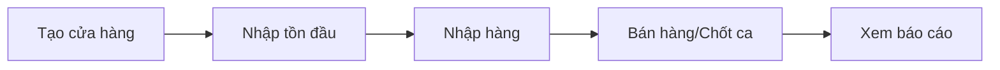

# Hệ Thống Quản Lý Tồn Kho Đơn Giản

## ✅ Đã bỏ hoàn toàn quản lý theo Tank (Bể chứa)

Hệ thống mới **CHỈ quản lý theo Cửa hàng + Mặt hàng**. Đơn giản, không phức tạp.

---

## 🎯 Nguyên tắc hoạt động

### Single Source of Truth: `inventory_ledger`

**MỌI giao dịch nhập/xuất đều ghi vào 1 bảng duy nhất:**

```sql
inventory_ledger
├── warehouse_id  ✅ (Kho của cửa hàng)
├── product_id    ✅ (Mặt hàng)
├── tank_id       ⚠️ (NULL - không dùng nữa)
├── quantity_in   ✅ (Số lượng nhập)
├── quantity_out  ✅ (Số lượng xuất)
└── ref_type      ✅ (IMPORT/EXPORT/SHIFT_SALE/ADJUSTMENT)
```

**Tồn kho = SUM(quantity_in) - SUM(quantity_out)**

---

## 📡 API Endpoints

### 1. Nhập tồn đầu (Simple)
```http
POST /inventory/simple-initial-stock
Authorization: Bearer {token}

{
  "storeId": 1,
  "effectiveDate": "2026-01-06",
  "items": [
    {
      "productId": 1,
      "quantity": 15000,
      "notes": "Xăng RON 95"
    },
    {
      "productId": 2,
      "quantity": 8000,
      "notes": "Xăng E5"
    }
  ],
  "notes": "Nhập tồn đầu tháng 1/2026"
}
```

**Response:**
```json
{
  "success": true,
  "storeId": 1,
  "warehouseId": 5,
  "adjustments": [
    {
      "productId": 1,
      "currentStock": 0,
      "targetStock": 15000,
      "adjustment": 15000
    },
    {
      "productId": 2,
      "currentStock": 0,
      "targetStock": 8000,
      "adjustment": 8000
    }
  ]
}
```

---

### 2. Báo cáo tồn kho theo mặt hàng
```http
GET /inventory/stock-summary/:storeId
Authorization: Bearer {token}
```

**Response:**
```json
{
  "storeId": 1,
  "warehouseId": 5,
  "reportDate": "2026-01-06T10:30:00.000Z",
  "products": [
    {
      "productId": 1,
      "productCode": "RON95",
      "productName": "Xăng RON 95",
      "totalStock": 15000,
      "unit": "lít"
    },
    {
      "productId": 2,
      "productCode": "E5",
      "productName": "Xăng E5 RON 92",
      "totalStock": 8000,
      "unit": "lít"
    }
  ]
}
```

---

### 3. Nhập hàng
```http
POST /inventory/import

{
  "storeId": 1,
  "docType": "IMPORT",
  "docDate": "2026-01-06",
  "supplierName": "Petrolimex",
  "invoiceNumber": "INV-2026-001",
  "items": [
    {
      "productId": 1,
      "quantity": 5000,
      "unitPrice": 25000,
      "tankId": null  // ✅ Không cần tankId
    }
  ]
}
```

---

### 4. Chốt ca (Tự động trừ tồn)
```http
POST /shifts/close

// Hệ thống tự động ghi vào inventory_ledger
// với refType = 'SHIFT_SALE'
```

---

## 🖥️ Giao diện FrontEnd

### 1. Trang Nhập Tồn Đầu
**File:** `/FrontEnd/src/pages/InitialStock.tsx`

**Tính năng:**
- Chọn cửa hàng
- Thêm nhiều mặt hàng
- Nhập số lượng tồn đầu
- Không cần chọn bể chứa (tank)
- Tự động điều chỉnh tồn kho

**Route:** `/initial-stock`

---

### 2. Trang Báo Cáo Tồn Kho
**File:** `/FrontEnd/src/pages/StockReport.tsx`

**Tính năng:**
- Chọn cửa hàng
- Xem tổng tồn từng mặt hàng
- Không hiển thị thông tin bể
- Tính tổng tự động

**Route:** `/stock-report`

---

## 🔧 Cài đặt Routing

Thêm vào `App.tsx` hoặc router config:

```tsx
import InitialStock from './pages/InitialStock';
import StockReport from './pages/StockReport';

// Trong routes:
<Route path="/initial-stock" element={<InitialStock />} />
<Route path="/stock-report" element={<StockReport />} />
```

Thêm vào menu:

```tsx
<Link to="/initial-stock">📦 Nhập Tồn Đầu</Link>
<Link to="/stock-report">📊 Báo Cáo Tồn Kho</Link>
```

---

## 📊 Luồng nghiệp vụ

### Khi mở cửa hàng mới:



### Chi tiết:

1. **Nhập tồn đầu** → POST `/inventory/simple-initial-stock`
   - Ghi vào `inventory_ledger` với `refType = ADJUSTMENT`
   
2. **Nhập hàng** → POST `/inventory/import`
   - Ghi vào `inventory_ledger` với `quantityIn`
   
3. **Chốt ca** → POST `/shifts/close`
   - Tự động ghi xuất kho vào `inventory_ledger` với `quantityOut`
   
4. **Xem tồn** → GET `/inventory/stock-summary/:storeId`
   - Tính SUM từ `inventory_ledger`

---

## 🎨 Ví dụ sử dụng

### Cửa hàng A - Ngày đầu tiên:

```bash
# 1. Nhập tồn đầu
curl -X POST /inventory/simple-initial-stock \
  -H "Authorization: Bearer TOKEN" \
  -d '{
    "storeId": 1,
    "items": [
      {"productId": 1, "quantity": 10000},
      {"productId": 2, "quantity": 5000}
    ]
  }'

# 2. Nhập thêm hàng
curl -X POST /inventory/import \
  -d '{
    "storeId": 1,
    "docType": "IMPORT",
    "items": [
      {"productId": 1, "quantity": 5000, "unitPrice": 25000}
    ]
  }'

# 3. Xem tồn hiện tại
curl -X GET /inventory/stock-summary/1

# Response:
# RON95: 15000 lít (10000 + 5000)
# E5:    5000 lít
```

---

## ⚠️ Lưu ý quan trọng

### ✅ Làm:
- Quản lý theo cửa hàng + mặt hàng
- Dùng API `/simple-initial-stock` để nhập tồn đầu
- Dùng API `/stock-summary/:storeId` để xem tồn
- Để `tankId = null` khi nhập/xuất

### ❌ Không làm:
- ~~Quản lý theo tank/bể chứa~~
- ~~Kiểm tra dung tích bể~~
- ~~Phân bổ hàng vào bể cụ thể~~
- ~~Dùng API `/stock-report/:storeId` (chi tiết tank)~~

---

## 🚀 Deploy

1. **Backend:**
   ```bash
   cd BackEnd
   npm run build
   npm run start:prod
   ```

2. **FrontEnd:**
   ```bash
   cd FrontEnd
   npm run build
   # Upload dist/ to hosting
   ```

3. **Database:**
   - Migration tự động chạy khi start
   - Cột `tank_id` trong `inventory_ledger` đã là `nullable`

---

## 📞 Hỗ trợ

Nếu cần thêm tính năng:
- Xuất Excel báo cáo tồn kho
- Lịch sử nhập/xuất theo mặt hàng
- Cảnh báo tồn kho thấp
- API tích hợp

→ Mở rộng từ base code hiện tại!
